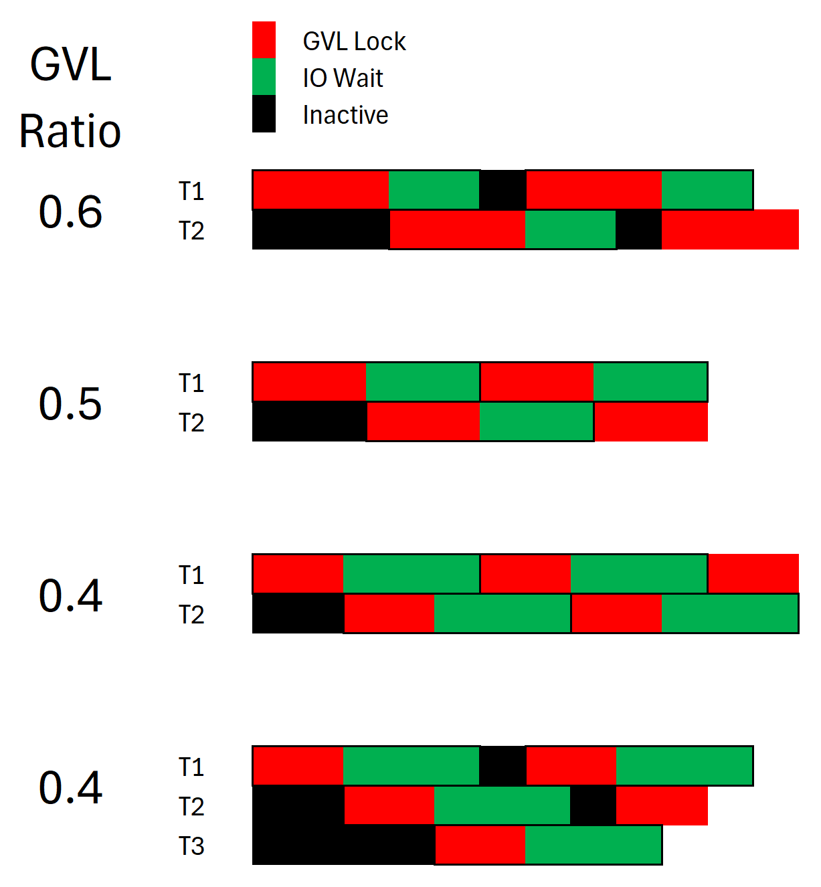

## App GVL & Threads

I recently split my Puma test setup between two desktops and was running various benchmarks comparing Puma v7 and v6.  In all cases, v7 performed better or equal to v6.

Some of the tests involved using `test/rackup/sleep_fibonacci.ru`, which simulates a 70% CPU/GVL with 30% non-blocking wait.

These tests show the issues involved with proper thread count calculation.

Two app setups were tested, both with a total app response time of 20 ms.  One had 70% CPU/GVL time, the other 35%.

With one process/worker and one thread, the maximum requests per second (RPS) would be 1/0.02, or 50.

Assuming a proper number of threads, what is the maximum RPS with one process/worker?  Since one thread can hold the GVL at a time, the formula is:

```
Max RPS  = 1 / (app response time * CPU%)
```

The 70% app would have a max RPS of 71, the 35% app would have a max RPS of 143.

What did the data show?
```
───────── 70% app ─────────          ───────── 35% app ─────────
RPS    50%     99%  Threads          RPS    50%     99%  Threads
49   0.0201  0.0224    1              47  0.0209  0.0224    1
70   0.0281  0.0315    2              96  0.0205  0.0223    2
70   0.0283  0.0304    3             135  0.0219  0.0255    3
```

Both data sets are within expected results.  Notice that the 70% app hit the maximum with two threads, but the 35% app required three threads to hit its max.

The formula for number of threads in terms of the GVL ratio is:
```
Minimum thread count = (1 / CPU%).ceil
```
Using that formula yields two thread for a 0.7 CPU app (`1.43.ceil`), and three threads for a 0.35 app (`2.85.ceil`), which agrees with the observed data.  In the below graphic, notice the two '0.4' diagrams.  In the 'two threads' diagram, there is a portion of time where both requests/threads are in an 'IO wait' state, which means that the RPS will drop.  The 'three threads' diagram shows that at any moment in time, the GVL lock is in place.




### Takeaways:

1. Maximum thread count used should match the CPU% for the majority of requests.  Going above that number may not yield a higher RPS.

2. If your server is hit with more requests than it can process, the RPS will probably stay the same, but the 'queue' time will increase.  Or, requests will be in Puma's request queue for a longer period of time.

### Caveats:

1. Puma also has other tasks running.  Accepting and parsing requests, running hooks, and keeping track of the processes and threads.  These will lock the GVL, lowering the RPS and lengthening the queue time.

2. Different requests will have varying GVL ratios.  See [issue 3777](https://github.com/puma/puma/issues/3777) for a discussion related to possible options for that.

3. As the GVL ratio approaches zero, the request becomes equivalent to a `sleep` statement.  Using a 'Hello World' app or a short sleep app yield very high RPS counts, but aren't really a good indicator of server performance.

4. More links ?
